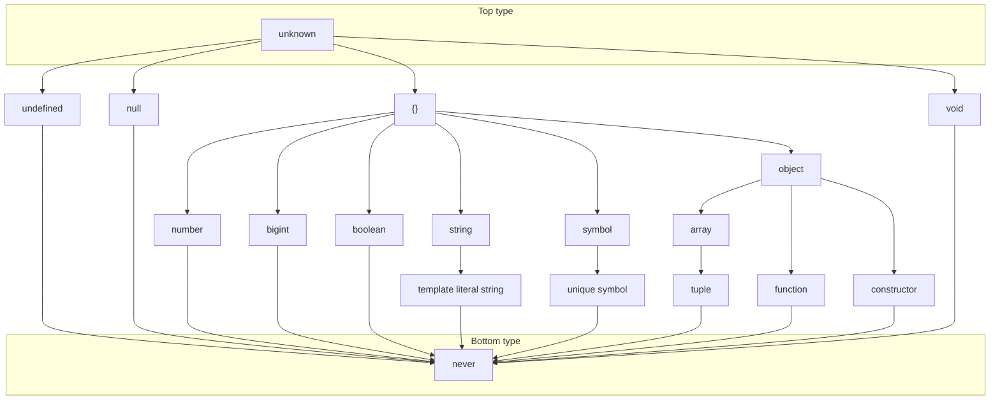

# <MdiLanguageTypescript class="text-[#3178c6]" /> Subtyping in TypeScript

<p class="text-2xl indent-88px">TypeScript 中的子类型</p>

<footer class="absolute bottom-10 right-14 text-sm opacity-50">xunmi 2022-10</footer>


---

# Subtyping

子类型

如果类型 $S$ 的对象可以安全地替换类型 $T$ 的对象，则类型 $S$ 是类型 $T$ 的子类型，记作 $S <: T$

即符合里氏替换原则（Liskov Substitution principle）

一个对象可能同时属于多种类型，在面向对象程序设计中，多态一般指的是 “子类型多态”

<div class="mt-12">

- 子类型为了实现**可替换性**，反映了类型之间的关系
- 继承是为了实现**代码复用**，一般同时声明了子类型关系

</div>


---

# Type compatibility

类型兼容



<div class="text-xs opacity-50 !all:m-0">

- `void` 类型情况特殊，[`undefined` 类型可以**分配**给 `void` 类型](https://www.typescriptlang.org/docs/handbook/type-compatibility.html#any-unknown-object-void-undefined-null-and-never-assignability)
- TypeScript v4.8 中，[`unknown` 类型被近似处理为 `{} | null | undefined`](https://www.typescriptlang.org/docs/handbook/release-notes/typescript-4-8.html#improved-intersection-reduction-union-compatibility-and-narrowing)
- `any` 类型被视为 “放弃类型检查”

</div>


---
layout: two-cols
---

<style>
.slidev-layout[layout="two-cols"] {
  gap: 2rem;
}
</style>

## Nominal Type System

<p class="opacity-50 !mt-0">名义子类型</p>

<div class="min-h-30">

- 必须显式声明子类型关系
- 类型声明的名字相同时，类型相同
- 如 Java、C#、Python 的[抽象基类](https://docs.python.org/3.9/library/abc.html)等

</div>

```java {all|5}
interface T {
   int add(int value);
}

class S implements T {
   int result;
   int add(int value) {/** ... */}
}

S a = new S();
T b = a;
```

::right::

## Structural Type System

<p class="opacity-50 !mt-0">结构子类型</p>

<div class="min-h-30">

- 不需要显式声明子类型关系
- 需要包含父类型声明的所有成员
- 如 TypeScript、Python 的[协议](https://peps.python.org/pep-0544/)等

</div>

```ts {all|2,6-7}
type T = {
  readonly add: (value: number) => number | undefined;
}

type S = {
  readonly result: number;
  readonly add: (value: number | string) => number;
}

const a: S = {/** ... */}
const b: T = a;
```

<v-click>

在 TypeScript 中，可以使用 `unique symbol` 模拟实现名义子类型

</v-click>


---

# Subtyping rules

子类型规则

|     |     |     |
| --- | --- |:---:|
| S-Refl  | 自反性 | $\frac{}{S <: S}$ |
| S-Trans | 传递性 | $\frac{S <: U\quad U <: T}{S <: T}$ |
| S-Top   |       | $\frac{}{S <: unknown}$ |
| S-Arrow |       | $\frac{T_1 <: S_1\quad S_2 <: T_2}{S_1\rightarrow S_2\ <:\ T_1\rightarrow T_2}$ |

<div class="mt-12">

> 在 TypeScript 中，`unknown` 是作为顶层类型

> $T_1 \rightarrow T_2$：代表构造了参数类型是 $T1$，返回值类型是 $T2$ 的函数类型

</div>


---

# Covariance and contravariance

协变与逆变

|     |     |     |
| --- | --- | --- |
| covariant     | 协变 | 保持子类型的顺序关系
| contravariant | 逆变 | 逆转子类型的顺序关系
| invariant     | 不变 | 协变且逆变，即不发生变化

<div class="mt-12">
<v-click>

```ts
const toLooseNumber: (x: unknown) => number = x => {
  return Number(x);
};

const toNumber: (x: string) => number | undefined = toLooseNumber;
```

</v-click>
</div>


---

# Function types

函数类型

$$
\frac{T_1 <: S_1\quad S_2 <: T_2}{S_1\rightarrow S_2\ <:\ T_1\rightarrow T_2}
$$

<div class="text-center">

对于函数类型 $T_1 \rightarrow T_2$，其子类型为 $S_1 \rightarrow S_2$，则 $T_1 \rightarrow S_1$ 且 $S_2 \rightarrow T_2$。

</div>

```ts
type S1 = unknown;
type S2 = number;
type T1 = string;
type T2 = unknown;

const toLooseNumber: (x: S1) => S2 = { /** ... */ };

const toNumber: (x: T1) => T2 = toLooseNumber;
```

<v-click>
<div class="text-center text-3xl text-orange-400 mt-12">
参数位置类型逆变，返回位置类型协变
</div>
</v-click>


---

# Invariance

不变

<div class="grid grid-cols-2 gap-8">
<div>

```ts
const list1: number[] = [];
const list2: unknown[] = list1;

list2.push('😵');

// ???
list1[0].toFixed();
```

```ts {4-6}
// lib.es5.d.ts
interface Array<T> {
  // ...
  push(...items: T[]): number;
  pop(): T | undefined;
  // ...
}
```

</div>

<div>
<v-click>

- `push`: $T$ 在函数类型的参数位置，要求逆变
- `pop`: $T$ 在函数类型的返回位置，要求协变

所以，$T$ 类型不变，`number[]` 和 `unknown[]` 不存在子类型关系

<!-- number[] <: readonly unknown[] -->

</v-click>

<v-click>

<div class="text-orange-400">

在 TypeScript 中，允许了**方法**的参数是双变的

</div>

所以，$T$ 类型协变，`number[]` 是 `unknown[]` 的子类型

> 安全的协变数组是 $readonly\ T[]$

</v-click>
</div>
</div>

<v-click>
<div class="text-xs opacity-50 !all:m-0">

- [TypeScript v4.7 中，可以手动标记类型协变（out）或逆变（in）](https://www.typescriptlang.org/docs/handbook/release-notes/typescript-4-7.html#optional-variance-annotations-for-type-parameters)
- Java 支持协变数组，但报运行时错误 `ArrayStoreException`。使用 `extends` 限制泛型协变，`super` 限制逆变
- Swift 不支持协变数组，但编译器会进行隐式类型转换

</div>
</v-click>


---

# Record types

记录（对象）类型

- 宽度子类型（width subtyping）：$S$ 比 $T$ 拥有更多的成员类型
- 深度子类型（depth subtyping）：$S$ 的只读（immutable）成员类型可以替换为 $T$ 对应的成员类型

```ts {all|7,11}
type T = {
  readonly name: string | undefined;
};

type S1 = {
  readonly name: string | undefined;
  readonly value: number;
};

type S2 = {
  readonly name: string;
};
```

<v-after>

- $S1$ 比 $T$ 多出 `value` 字段，$S1$ 是 $T$ 的子类型
- $S2$ 的成员字段的类型是 $T$ 对应字段的子类型，$S2$ 是 $T$ 的子类型

</v-after>


---

# Record types

记录（对象）类型

```ts
type S = { value: number };
type T = { value: unknown };

const data1: S = { value: 1 };
const data2: T = data1;

data2.value = '😢';

// ???
data1.value.toFixed();
```
<v-click>

只能让对象的 `immutable` 字段协变，而 `mutable` 字段不变

`value` 是**可变**字段，所以 $S$ 和 $T$ 不存在子类型关系

</v-click>

<v-click>

<div class="text-orange-400">

在 TypeScript 中，允许了 `mutable` 字段协变

</div>

所以 $S$ 是 $T$ 的子类型

</v-click>


---

<style>
.tiny-table :is(td, th) {
  padding: 0.5rem !important;
}
</style>

# Rust subtyping

Rust 中的子类型

<div class="tiny-table">

|     | 'a  | T   | U   |
| --- |:---:|:---:|:---:|
| `&'a T `        | covariant | covariant         |           |
| `&'a mut T`     | covariant | invariant         |           |
| `Box<T>`        |           | covariant         |           |
| `Vec<T>`        |           | covariant         |           |
| `UnsafeCell<T>` |           | invariant         |           |
| `Cell<T>`       |           | invariant         |           |
| `fn(T) -> U`    |           | **contra**variant | covariant |
| `*const T`      |           | covariant         |           |
| `*mut T`        |           | invariant         |           |

</div>

<div class="text-xs opacity-50 !all:m-0 mt-4">

- `UnsafeCell`、`Cell` 用于实现内部可变性（Interior mutability），在运行时执行借用检查
- [The Rustonomicon - Subtyping and Variance](https://doc.rust-lang.org/nomicon/subtyping.html)

</div>


---

## Intersection Types

交叉类型

$$
\frac{}{T_1\cap T_2\ <:\ T_1}
\qquad
\frac{}{T_1\cap T_2\ <:\ T_2}
\\[1em]
\frac{S <: T_1\quad S <: T_2}{S\ <:\ T_1\cap T_2}
$$

```ts {1-5|7-11}
type T1 = number;
type T2 = string;

// `never`
type S = T1 & T2;

type T1 = { name: string };
type T2 = { value: number };

// `{ name: string; value: number }`
type S = T1 & T2;
```


---

# Union Types

联合类型

$$
\frac{}{T_1\ <:\ T_1\cup T_2}
\qquad
\frac{}{T_2\ <:\ T_1\cup T_2}
\\[1em]
\frac{T_1 <: S\quad T_2 <: S}{T_1\cup T_2\ <:\ S}
$$

```ts {1-5|7-11}
type S1 = number;
type S2 = string;

// `number` 或者 `string`
type T = S1 | S2;

type S1 = { name: string };
type S2 = { value: number };

// `{ name: string }` 或者 `{ value: number }`
type T = S1 | S2;
```


---
layout: quote
---

# References

参考资料

- [Wikipedia - Subtyping](https://en.wikipedia.org/wiki/Subtyping)
- [From OO, to OO: Subtyping as a Cross-cutting Language Feature](https://paulz.me/files/subtyping.pdf)
- [Subtyping in TypeScript](https://zhuanlan.zhihu.com/p/371112840)
- [The TypeScript Handbook](https://www.typescriptlang.org/docs/handbook/intro.html)
